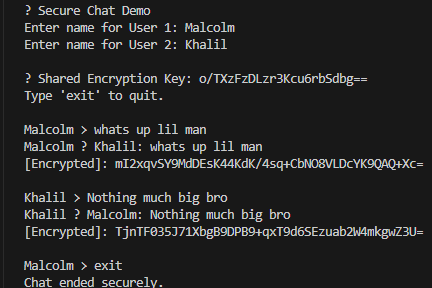

# 🔐 SecureChatApp
A Java console-based chat application that uses **AES encryption** to secure communication between users.  
Built by **Malcolm Grant**, Information Technology / Cybersecurity student at **Towson University**.

---

## 🧠 Overview
This project simulates how encrypted communication works in real-world secure messaging systems.  
It uses **Advanced Encryption Standard (AES)** to encrypt and decrypt messages between two users, ensuring that private data remains unreadable to unauthorized parties.

---

## ⚙️ Features
✅ AES encryption and decryption for secure messaging  
✅ Randomly generated secret keys for each session  
✅ Console-based interactive chat interface  
✅ Demonstrates key cybersecurity principles (confidentiality, integrity)  
✅ Modular Java code for easy understanding and extension  

---

## 🧩 Tech Stack
- **Language:** Java 17+  
- **Encryption:** AES (Advanced Encryption Standard)  
- **IDE:** Visual Studio Code  
- **Version Control:** Git + GitHub  

---

## ▶️ How to Run

# 1. Compile
javac SecureChat.java ChatUtils.java

# 2. Run
java -cp . SecureChat
## 📸 Demo Screenshot
